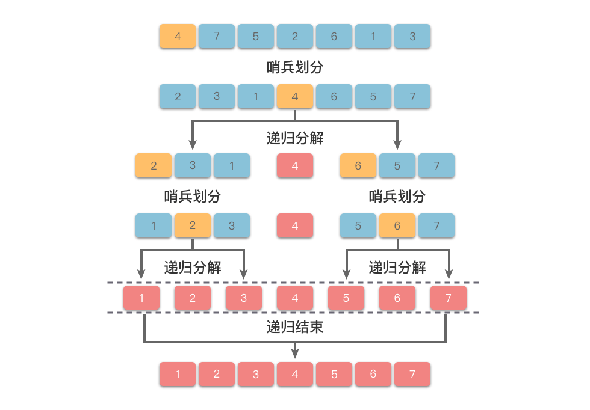

# 数组排序

稳定排序：如果一个排序算法能够保留相等元素的相对位置，则称其为稳定排序。
不稳定排序：如果一个排序算法不能保留相等元素的相对位置，则称其为不稳定排序。

1. 冒泡排序--[code](./bubble_sort.cpp)：通过相邻元素之间的比较与交换，使值较小的元素逐步从后面移到前面，值较大的元素从前面移到后面。时间复杂度为 O(n^2)，空间复杂度为 O(1)，稳定排序。

2. 选择排序--[code](./selection_sort.cpp)：每次从未排序的部分中选出最小的元素，放到已排序部分的末尾。时间复杂度为 O(n^2)，空间复杂度为 O(1)，不稳定排序。

3. 插入排序--[code](./insertion_sort.cpp)：将数组分为两个区间：左侧为有序区间，右侧为无序区间。每趟从无序区间取出一个元素，然后将其插入到有序区间的适当位置。时间复杂度最差 O(n^2)，最好时 O(n)，空间复杂度为 O(1)，稳定排序。

4. 归并排序--[code](./merge_sort.cpp)：采用分治法，将数组分为两部分，分别排序，然后合并。时间复杂度为 O(nlogn)，空间复杂度为 O(n)，稳定排序。

5. 快速排序--[code](./quick_sort.cpp)：通过一趟排序将待排序数组分割成独立的两部分，其中一部分的所有元素都比另一部分的所有元素小，然后分别对这两部分继续进行排序。时间复杂度为 O(nlogn)，空间复杂度为 O(logn)，不稳定排序。

